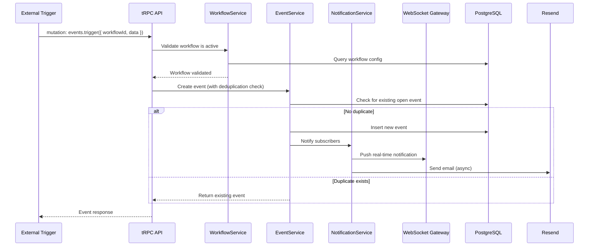
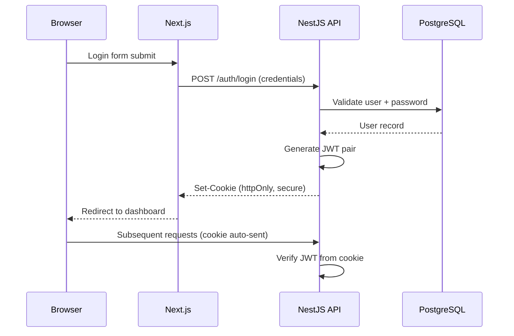

# Workflow Manager - Architecture Documentation

## 1. How to Read This Document

This document describes the architecture of the Workflow Manager application. It is intended for developers working on the project and covers the technology stack, project structure, design principles, and key architectural decisions.

Sections are organized from high-level overview to specific subsystems. Read sections 1-5 for a general understanding; consult specific sections as needed during development.

---

## 2. Overview

Workflow Manager is a full-stack application for creating and managing alert workflows with **end-to-end type safety**. Users can define workflows that trigger alerts based on configurable conditions, view event history, resolve or snooze alerts, and receive notifications.

### Key Capabilities

- Create, edit, activate/deactivate alert workflows
- Trigger events with deduplication of open events
- Event history with pagination and filtering
- Snooze and comment on events
- Real-time notifications (in-app + email)
- Daily summary reports (cron job)

### High-Level Architecture

```
┌─────────────────────────────────────────────────────┐
│                   Turborepo Monorepo                 │
│                                                     │
│  ┌──────────────┐    tRPC (e2e types)  ┌──────────┐ │
│  │  Next.js 15  │ ◄──────────────────► │ NestJS   │ │
│  │  App Router  │                      │ Fastify  │ │
│  │  (Frontend)  │     WebSocket/SSE    │ (Backend)│ │
│  │              │ ◄──────────────────► │          │ │
│  └──────────────┘                      └────┬─────┘ │
│                                             │       │
│  ┌──────────────┐                      ┌────▼─────┐ │
│  │  packages/   │                      │PostgreSQL│ │
│  │  prisma      │─────────────────────►│          │ │
│  │  shared      │                      └──────────┘ │
│  └──────────────┘                                   │
└─────────────────────────────────────────────────────┘
```

---

## 3. Technology Stack

| Layer          | Technology                  | Version  | Purpose                              |
| -------------- | --------------------------- | -------- | ------------------------------------ |
| **Runtime**    | Node.js                     | 20 LTS   | Server runtime                       |
| **Backend**    | NestJS                      | 10+      | Backend framework                    |
| **HTTP**       | Fastify                     | 5.x      | HTTP adapter (replaces Express)      |
| **API**        | tRPC                        | v11      | End-to-end type-safe API layer       |
| **tRPC bridge**| nestjs-trpc                 | latest   | tRPC integration for NestJS          |
| **Frontend**   | Next.js                     | 15+      | React framework (App Router)         |
| **UI**         | React                       | 19+      | UI library                           |
| **Database**   | PostgreSQL                  | 16+      | Relational database                  |
| **ORM**        | Prisma                      | latest   | Database ORM + migrations            |
| **Validation** | Zod                         | latest   | Schema validation (tRPC + forms)     |
| **Auth**       | JWT (httpOnly cookies)      | -        | Authentication with Passport         |
| **Real-time**  | WebSocket / SSE             | -        | Live alert notifications             |
| **Monorepo**   | Turborepo + pnpm            | latest   | Build orchestration + package manager|
| **Styling**    | Tailwind CSS                | 4.x      | Utility-first CSS                    |
| **UI Kit**     | shadcn/ui                   | latest   | Radix UI-based component library     |
| **Containerization** | Docker + Docker Compose | -     | Local development environment        |

---

## 4. Project Structure

```
workflow-manager/
├── apps/
│   ├── backend/                    # NestJS + tRPC API
│   │   └── src/
│   │       ├── features/           # Feature modules (domain-driven)
│   │       │   ├── workflows/      # CRUD, activate/deactivate
│   │       │   ├── events/         # Trigger, history, resolve, snooze
│   │       │   ├── notifications/  # In-app + email channels
│   │       │   ├── history/        # Paginated, filtered event history
│   │       │   └── daily-summary/  # Cron-based daily reports
│   │       ├── trpc/
│   │       │   ├── routers/        # tRPC app router
│   │       │   └── context.ts      # tRPC context (auth, db)
│   │       ├── common/             # Filters, guards, interceptors
│   │       ├── modules/            # Independent external API modules
│   │       │   └── resend/         # Email provider (example)
│   │       ├── config/             # App configuration
│   │       ├── database/           # Prisma repository layer (optional)
│   │       ├── utils/              # Shared utilities
│   │       └── main.ts             # Entry point
│   │
│   └── frontend/                   # Next.js 15 App Router
│       └── src/
│           ├── app/
│           │   ├── (dashboard)/    # Dashboard route group
│           │   │   ├── workflows/  # Workflow pages
│           │   │   ├── events/     # Event pages
│           │   │   └── history/    # History pages
│           │   ├── api/            # tRPC client (auto-generated)
│           │   └── globals.css     # Global styles
│           ├── features/           # Feature-specific components + hooks
│           │   ├── workflows/
│           │   ├── events/
│           │   ├── history/
│           │   └── notifications/
│           ├── components/         # Shared UI components (shadcn)
│           ├── lib/
│           │   └── trpc.ts         # tRPC client setup
│           └── types/              # Shared TypeScript types
│
├── packages/
│   ├── prisma/                     # Shared Prisma schema + client
│   │   ├── schema.prisma
│   │   └── seed.ts
│   └── shared/                     # Shared types and utilities
│
├── docs/                           # TRIP documentation
│   ├── ARCHI.md
│   ├── ARCHI-rules.md
│   ├── BEST-PRACTICES.md
│   ├── TRIP-config.md
│   ├── 1-plans/
│   ├── 2-changelog/
│   ├── 3-code-review/
│   ├── 4-unit-tests/
│   └── 6-memo/
│
├── docker-compose.yml              # PostgreSQL + Redis (dev)
├── turbo.json                      # Turborepo pipeline config
├── package.json                    # Root workspace config
├── GUIA_DE_DESARROLLO.md           # Development guide (Spanish)
└── .env.example                    # Environment variable template
```

---

## 5. Core Architecture Principles

1. **End-to-End Type Safety** - tRPC ensures types flow from database schema (Prisma) through the API layer to the frontend with zero code generation or manual type duplication.

2. **Feature-Folder Organization** - Both backend and frontend are organized by domain feature (workflows, events, notifications), not by technical layer. Each feature is a self-contained NestJS module that owns its router, service, and DTOs.

3. **Independent External Modules** - External API integrations (email, Slack, etc.) live in `src/modules/` as pure NestJS modules with no tRPC dependency, making them portable and testable in isolation.

4. **Thin Controllers / Routers** - tRPC routers (using `@Router()`, `@Query()`, `@Mutation()`) only validate input and delegate to services. All business logic lives in services.

5. **Shared Packages** - Prisma client and common types live in `packages/` to be consumed by both apps, avoiding duplication.

6. **Real-Time First** - Alert notifications are delivered in real-time via WebSocket/SSE, not just on page refresh.

---

## 6. Build System & Toolchain

### Monorepo Management

- **Turborepo** orchestrates builds across apps and packages with caching
- **pnpm** manages dependencies with workspace protocol

### Key Commands

```bash
# Install all dependencies
pnpm install

# Run all apps in development
pnpm dev

# Build all apps
pnpm build

# Run specific app
pnpm --filter backend dev
pnpm --filter frontend dev

# Prisma operations
pnpm --filter prisma db:generate   # Generate Prisma client
pnpm --filter prisma db:push       # Push schema to DB
pnpm --filter prisma db:seed       # Seed database
pnpm --filter prisma db:migrate    # Run migrations
```

### Turborepo Pipeline

```json
{
  "pipeline": {
    "build": { "dependsOn": ["^build"] },
    "dev": { "cache": false, "persistent": true },
    "lint": {},
    "test": { "dependsOn": ["build"] }
  }
}
```

---

## 7. Configuration

### Environment Variables

| Variable            | Description                    | Default       |
| ------------------- | ------------------------------ | ------------- |
| `DATABASE_URL`      | PostgreSQL connection string   | -             |
| `JWT_SECRET`        | JWT signing secret (min 32ch)  | -             |
| `JWT_REFRESH_SECRET`| Refresh token secret           | -             |
| `JWT_EXPIRATION`    | Access token TTL               | `15m`         |
| `COOKIE_DOMAIN`     | httpOnly cookie domain         | `localhost`   |
| `RESEND_API_KEY`    | Email provider API key         | -             |
| `REDIS_URL`         | Redis connection (queues/cache)| -             |
| `NODE_ENV`          | Environment                    | `development` |

### Configuration Approach

- **NestJS ConfigModule** with Zod validation at startup
- Environment variables loaded from `.env` files (per-app)
- Typed config namespaces (`database`, `auth`, `email`)
- Fail-fast: app refuses to start if required vars are missing

---

## 8. API Design (tRPC)

### Router Structure

```typescript
// app.router.ts - Root router merging all feature routers
export const appRouter = router({
  workflows: workflowRouter,
  events: eventRouter,
  notifications: notificationRouter,
  history: historyRouter,
});

export type AppRouter = typeof appRouter;
```

### tRPC Context

```typescript
// context.ts - Auth + DB injected into every procedure
export const createContext = (req: FastifyRequest) => ({
  user: req.user,        // From JWT cookie
  prisma: prismaClient,  // Shared Prisma instance
});
```

### Procedure Patterns

- **Public procedures**: Login, registration, health check
- **Protected procedures**: All workflow/event operations (JWT guard)
- **Input validation**: Zod schemas on every mutation and parameterized query
- **Error handling**: tRPC error codes mapped to domain exceptions

---

## 9. Database Layer (Prisma)

### Core Models

- **Workflow** - Alert workflow definition (name, conditions, active status)
- **Event** - Triggered alert instance (status: open/resolved/snoozed)
- **EventHistory** - Audit log of event state changes
- **Comment** - User comments on events
- **Snooze** - Snooze configuration per event
- **User** - Application users with roles

### Prisma Conventions

- Schema lives in `packages/prisma/schema.prisma`
- Generated client is shared across backend via workspace dependency
- Migrations managed with `prisma migrate dev`
- Seed script for development data in `packages/prisma/seed.ts`

### Query Patterns

- Use Prisma's `include` for eager loading (avoid N+1)
- Use `select` for projection (only fetch needed fields)
- Transactions for multi-model writes (`prisma.$transaction`)
- Pagination with cursor-based or offset patterns

---

## 10. Authentication & Authorization

### Auth Flow

```
1. User submits credentials → POST /auth/login
2. Backend validates → issues JWT access + refresh tokens
3. Tokens stored in httpOnly secure cookies
4. Every request: cookie parsed → JWT verified → user injected into tRPC context
5. Refresh: access token expired → refresh endpoint → new token pair → rotate refresh
```

### Security Measures

- **httpOnly cookies** - Tokens not accessible via JavaScript (XSS protection)
- **Secure flag** - Cookies only sent over HTTPS in production
- **SameSite=Strict** - CSRF protection
- **Short-lived access tokens** (15 min) with refresh rotation
- **Password hashing** - bcrypt with cost factor >= 12

### Authorization

- Role-based guards on tRPC procedures
- Guards applied via NestJS decorators (`@UseGuards`)
- Ownership checks for resource-level authorization

---

## 11. Real-Time Architecture

### Approach

WebSocket (via `@nestjs/websockets` + Fastify WebSocket adapter) for pushing live updates to connected clients.

### Use Cases

- New alert triggered → push to dashboard
- Event resolved/snoozed → update all connected clients viewing that event
- Notification delivery → instant in-app notification

### Architecture

```
┌──────────┐  subscribe   ┌──────────────┐  emit    ┌──────────┐
│  Client  │ ◄──────────► │  WS Gateway  │ ◄─────── │ Services │
│ (Next.js)│              │  (NestJS)    │          │          │
└──────────┘              └──────────────┘          └──────────┘
```

- Gateway handles connection lifecycle and room-based subscriptions
- Services emit events through the gateway after mutations
- Frontend uses a custom hook (`useWebSocket`) to subscribe and update UI

---

## 12. Notifications System

### Channels

1. **In-app** - Real-time via WebSocket, persisted in database for history
2. **Email** - Via Resend (or similar provider) through independent module

### Architecture

- `NotificationsService` orchestrates channel delivery
- Each channel is an independent module (`modules/resend/`)
- Strategy pattern for adding new channels without modifying existing code
- Notification preferences per user (which channels, which event types)

---

## 13. Background Jobs

### Daily Summary (Cron)

- NestJS `@Cron()` decorator for scheduling
- Runs daily: aggregates open events, generates summary, sends via email
- Idempotent execution (safe to re-run)

### Future: Queue-Based Jobs

- BullMQ + Redis for async job processing (email sending, heavy computations)
- Exponential backoff for retries
- Dead letter queue for permanently failed jobs

---

## 14. Components & UI Architecture (Frontend)

### Component Organization

- **shadcn/ui** components in `src/components/` - shared, design-system level
- **Feature components** in `src/features/[feature]/` - domain-specific
- **Pages** in `src/app/(dashboard)/` - route-level, thin wrappers

### Patterns

- Server Components by default (Next.js 15 App Router)
- Client Components only when interactivity is needed (`"use client"`)
- Feature components own their hooks, types, and sub-components
- Barrel exports (`index.ts`) for clean imports

---

## 15. State Management (Frontend)

| State Type     | Solution                          | Example                          |
| -------------- | --------------------------------- | -------------------------------- |
| Server state   | tRPC + React Query (built-in)     | Workflows list, event details    |
| Local UI state | `useState`                        | Modal open/close, form inputs    |
| Global client  | Zustand (if needed)               | Theme, sidebar collapsed         |
| URL state      | Next.js searchParams              | Filters, pagination              |
| Real-time      | WebSocket subscription + React Query invalidation | Live alerts |

### Key Rule

Never duplicate server state in client stores. tRPC's React Query integration handles caching, refetching, and optimistic updates.

---

## 16. Routing (Frontend)

### Route Structure

```
app/
├── (auth)/
│   ├── login/page.tsx
│   └── register/page.tsx
├── (dashboard)/
│   ├── layout.tsx              # Dashboard shell (sidebar, header)
│   ├── workflows/
│   │   ├── page.tsx            # List workflows
│   │   └── [id]/page.tsx       # Workflow detail
│   ├── events/
│   │   ├── page.tsx            # Active events
│   │   └── [id]/page.tsx       # Event detail + comments
│   └── history/
│       └── page.tsx            # Event history with filters
└── api/
    └── trpc/[trpc]/route.ts    # tRPC HTTP handler
```

### Navigation Patterns

- Route groups `(auth)` and `(dashboard)` for layout separation
- Protected routes via middleware (JWT cookie check)
- Parallel routes for modals when needed

---

## 17. Styling Architecture (Frontend)

- **Tailwind CSS 4** for all styling (no inline styles, no CSS modules)
- **shadcn/ui** as the component library (Radix UI primitives + Tailwind)
- **CSS variables** for theming (dark/light mode support)
- **Responsive design** with Tailwind breakpoints

---

## 18. Data Flow Diagrams

### Alert Workflow Trigger Flow



### Authentication Flow



---

## 19. Error Handling Strategy

### Backend

- **Global exception filter** catches all unhandled exceptions
- **tRPC error codes** (`NOT_FOUND`, `UNAUTHORIZED`, `BAD_REQUEST`, etc.) for typed errors
- **Zod validation errors** automatically formatted by tRPC
- **Domain exceptions** thrown from services, caught and mapped by tRPC middleware
- **Structured logging** (Winston) with correlation IDs

### Frontend

- **tRPC error handling** via React Query's `onError` callbacks
- **Error boundaries** around feature sections (not individual components)
- **Toast notifications** for user-facing errors
- **Loading/Error/Empty states** for every data-dependent component

---

## 20. Testing Strategy

### Backend

| Type        | Framework  | Location                            | Purpose                    |
| ----------- | ---------- | ----------------------------------- | -------------------------- |
| Unit        | Jest       | `*.spec.ts` (co-located)            | Service logic, validators  |
| Integration | Jest       | `test/` directory                   | tRPC router + DB           |
| E2E         | Playwright | `apps/frontend/e2e/` or separate    | Full user flows            |

### Frontend

| Type      | Framework            | Location                 | Purpose                     |
| --------- | -------------------- | ------------------------ | --------------------------- |
| Unit      | Vitest + Testing Lib | `*.test.tsx` (co-located)| Component rendering, hooks  |
| E2E       | Playwright           | `e2e/`                   | Critical user journeys      |

### Coverage Expectations

- Backend services: aim for 80%+ coverage
- Frontend: focus on critical paths, not coverage numbers
- E2E: cover happy paths for core features (workflow CRUD, event lifecycle)

---

## 21. Performance Considerations

- **Prisma query optimization** - Use `select`/`include` deliberately, avoid fetching entire rows
- **Pagination** on all list endpoints (cursor-based preferred for real-time data)
- **React Server Components** - Reduce client-side JavaScript bundle
- **tRPC batching** - Multiple queries in a single HTTP request
- **WebSocket** over polling for real-time updates
- **Turborepo caching** - Speeds up builds by caching unchanged packages
- **Database indexes** on frequently queried fields (workflow status, event timestamps, user IDs)

---

## 22. Security Considerations

- **httpOnly JWT cookies** - Tokens never exposed to JavaScript
- **Zod validation** on every tRPC input - reject malformed data at the boundary
- **CORS** - Strict origin whitelist (never `*` in production)
- **Helmet** - Secure HTTP headers via Fastify plugin
- **Rate limiting** - Stricter on auth endpoints
- **Parameterized queries** - Prisma handles SQL injection prevention
- **Environment secrets** - Never hardcoded, loaded from env vars
- **CSRF protection** - SameSite cookies + optional CSRF token for mutations
- **Input sanitization** - Prevent XSS in user-generated content (comments)

---

## 23. Deployment

### Development

```bash
docker compose up -d    # PostgreSQL + Redis
pnpm install
pnpm dev                # Runs both apps via Turborepo
```

### Production (TBD)

- Containerized deployment (Docker)
- Backend: NestJS compiled + Fastify production mode
- Frontend: Next.js standalone output
- Database: Managed PostgreSQL (e.g., Supabase, Neon, RDS)
- CI/CD pipeline to be defined

---

## 24. Conclusion

Workflow Manager is a type-safe full-stack monorepo application designed around **domain-driven feature folders** and **end-to-end type safety via tRPC**. The architecture prioritizes:

1. **Developer experience** - Types flow from DB to UI with zero manual sync
2. **Modularity** - Features and external integrations are independent, testable modules
3. **Real-time** - Alerts are delivered instantly via WebSocket
4. **Security** - httpOnly JWT cookies, input validation at every boundary, CORS + Helmet

Key architectural decisions:
- tRPC over REST for type safety (no OpenAPI spec needed)
- Fastify over Express for better performance
- Feature folders over layer-based organization for scalability
- httpOnly cookies over localStorage for token storage
- Prisma over TypeORM/Sequelize for type-safe database access
