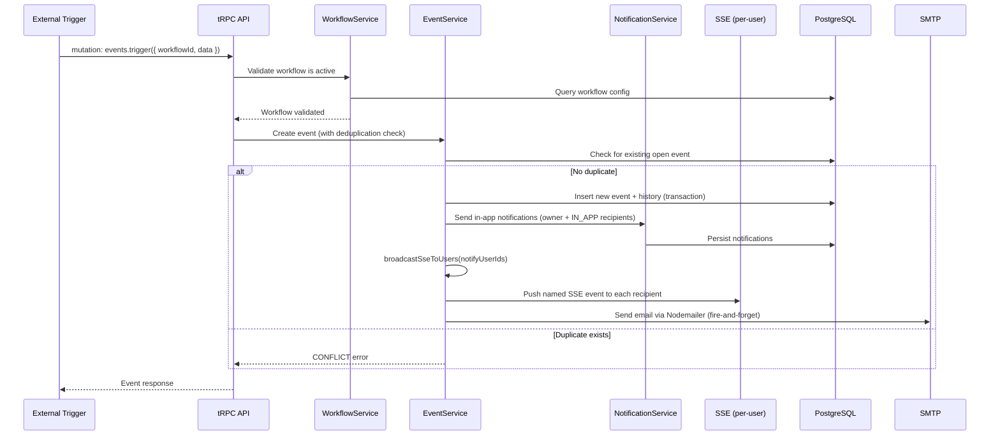
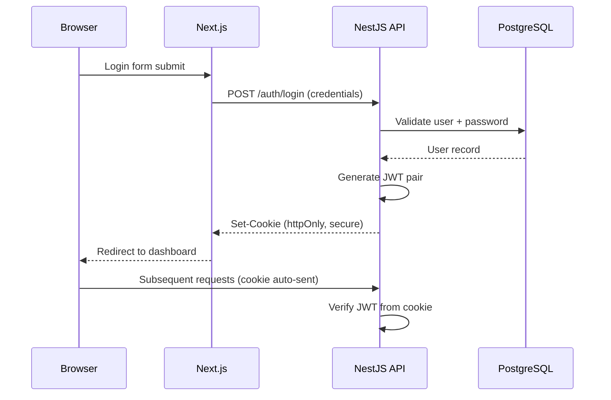

# Workflow Manager - Architecture Documentation

## 1. How to Read This Document

This document describes the architecture of the Workflow Manager application. It is intended for developers working on the project and covers the technology stack, project structure, design principles, and key architectural decisions.

Sections are organized from high-level overview to specific subsystems. Read sections 1-5 for a general understanding; consult specific sections as needed during development.

---

## 2. Overview

Workflow Manager is a full-stack application for creating and managing alert workflows with **end-to-end type safety**. Users can define workflows that trigger alerts based on configurable conditions, view event history, resolve or snooze alerts, and receive notifications.

### Key Capabilities

- Create, edit, activate/deactivate alert workflows
- Trigger events with deduplication of open events
- Event history with pagination and filtering
- Snooze and comment on events
- Real-time notifications (in-app + email)
- Daily summary reports (cron job)

### High-Level Architecture

```
┌─────────────────────────────────────────────────────┐
│                   Turborepo Monorepo                 │
│                                                     │
│  ┌──────────────┐    tRPC (e2e types)  ┌──────────┐ │
│  │  Next.js 15  │ ◄──────────────────► │ NestJS   │ │
│  │  App Router  │                      │ Fastify  │ │
│  │  (Frontend)  │     WebSocket/SSE    │ (Backend)│ │
│  │              │ ◄──────────────────► │          │ │
│  └──────────────┘                      └────┬─────┘ │
│                                             │       │
│  ┌──────────────┐                      ┌────▼─────┐ │
│  │  packages/   │                      │PostgreSQL│ │
│  │  prisma      │─────────────────────►│          │ │
│  │  shared      │                      └──────────┘ │
│  └──────────────┘                                   │
└─────────────────────────────────────────────────────┘
```

---

## 3. Technology Stack

| Layer                | Technology              | Version | Purpose                               |
| -------------------- | ----------------------- | ------- | ------------------------------------- |
| **Runtime**          | Node.js                 | 20 LTS  | Server runtime                        |
| **Backend**          | NestJS                  | 10+     | Backend framework                     |
| **HTTP**             | Fastify                 | 5.x     | HTTP adapter (replaces Express)       |
| **API**              | tRPC                    | v11     | End-to-end type-safe API layer        |
| **tRPC bridge**      | nestjs-trpc             | latest  | tRPC integration for NestJS           |
| **Frontend**         | Next.js                 | 15+     | React framework (App Router)          |
| **UI**               | React                   | 19+     | UI library                            |
| **Database**         | PostgreSQL              | 16+     | Relational database                   |
| **ORM**              | Prisma                  | latest  | Database ORM + migrations             |
| **Validation**       | Zod                     | latest  | Schema validation (tRPC + forms)      |
| **Auth**             | JWT (httpOnly cookies)  | -       | Authentication with Passport          |
| **Real-time**        | WebSocket / SSE         | -       | Live alert notifications              |
| **Monorepo**         | Turborepo + pnpm        | latest  | Build orchestration + package manager |
| **Styling**          | Tailwind CSS            | 4.x     | Utility-first CSS                     |
| **UI Kit**           | shadcn/ui               | latest  | Radix UI-based component library      |
| **Security**         | @fastify/helmet         | latest  | HTTP security headers (CSP, etc.)     |
| **Dev Mail**         | Mailpit                 | latest  | Local SMTP capture (dev email testing) |
| **Containerization** | Docker + Docker Compose | -       | Local development environment         |

---

## 4. Project Structure

```
workflow-manager/
├── apps/
│   ├── backend/                    # NestJS + tRPC API
│   │   └── src/
│   │       ├── features/           # Feature modules (domain-driven)
│   │       │   ├── workflows/      # CRUD, activate/deactivate, recipient dedup
│   │       │   ├── events/         # Trigger, history, resolve, snooze, snooze-expiration (hybrid)
│   │       │   ├── notifications/  # In-app + email channels
│   │       │   ├── mailer/         # Nodemailer SMTP transport + HTML templates
│   │       │   ├── config/         # App config feature flags
│   │       │   ├── users/          # User list endpoint
│   │       │   ├── history/        # Paginated, filtered event history
│   │       │   └── daily-summary/  # Cron-based daily reports
│   │       ├── trpc/
│   │       │   ├── routers/        # tRPC app router
│   │       │   └── context.ts      # tRPC context (auth, db)
│   │       ├── common/             # Filters, guards, interceptors
│   │       ├── modules/            # Independent external API modules
│   │       ├── config/             # App configuration
│   │       ├── database/           # Prisma repository layer (optional)
│   │       ├── utils/              # Shared utilities
│   │       └── main.ts             # Entry point
│   │
│   └── frontend/                   # Next.js 15 App Router
│       └── src/
│           ├── app/
│           │   ├── (dashboard)/    # Dashboard route group
│           │   │   ├── workflows/  # Workflow pages
│           │   │   ├── events/     # Event pages
│           │   │   └── history/    # History pages
│           │   ├── api/            # tRPC client (auto-generated)
│           │   └── globals.css     # Global styles
│           ├── features/           # Feature-specific components + hooks
│           │   ├── workflows/
│           │   ├── events/
│           │   ├── history/
│           │   └── notifications/
│           ├── components/         # Shared UI components (shadcn)
│           ├── lib/
│           │   ├── trpc.ts         # tRPC client setup
│           │   ├── trpc-types.ts   # inferRouterOutputs<AppRouter> type aliases
│           │   └── use-sse.hook.ts # Generic SSE hook with named event support
│           └── types/              # Shared TypeScript types
│
├── packages/
│   ├── prisma/                     # Shared Prisma schema + client
│   │   ├── schema.prisma
│   │   └── seed.ts
│   └── shared/                     # Shared types and utilities
│
├── docs/                           # TRIP documentation
│   ├── ARCHI.md
│   ├── ARCHI-rules.md
│   ├── BEST-PRACTICES.md
│   ├── TRIP-config.md
│   ├── 1-plans/
│   ├── 2-changelog/
│   ├── 3-code-review/
│   ├── 4-unit-tests/
│   └── 6-memo/
│
├── docker-compose.yml              # PostgreSQL + Mailpit (dev)
├── turbo.json                      # Turborepo pipeline config
├── package.json                    # Root workspace config
├── GUIA_DE_DESARROLLO.md           # Development guide (Spanish)
└── .env.example                    # Environment variable template
```

---

## 5. Core Architecture Principles

1. **End-to-End Type Safety** - tRPC ensures types flow from database schema (Prisma) through the API layer to the frontend with zero code generation or manual type duplication.

2. **Feature-Folder Organization** - Both backend and frontend are organized by domain feature (workflows, events, notifications), not by technical layer. Each feature is a self-contained NestJS module that owns its router, service, and DTOs.

3. **Independent External Modules** - External API integrations (email, Slack, etc.) live in `src/modules/` as pure NestJS modules with no tRPC dependency, making them portable and testable in isolation.

4. **Thin Controllers / Routers** - tRPC routers (using `@Router()`, `@Query()`, `@Mutation()`) only validate input and delegate to services. All business logic lives in services.

5. **Shared Packages** - Prisma client and common types live in `packages/` to be consumed by both apps, avoiding duplication.

6. **Real-Time First** - Alert notifications are delivered in real-time via WebSocket/SSE, not just on page refresh.

---

## 6. Build System & Toolchain

### Monorepo Management

- **Turborepo** orchestrates builds across apps and packages with caching
- **pnpm** manages dependencies with workspace protocol

### Key Commands

```bash
# Install all dependencies
pnpm install

# Run all apps in development
pnpm dev

# Build all apps
pnpm build

# Run specific app
pnpm --filter backend dev
pnpm --filter frontend dev

# Prisma operations
pnpm --filter prisma db:generate   # Generate Prisma client
pnpm --filter prisma db:push       # Push schema to DB
pnpm --filter prisma db:seed       # Seed database
pnpm --filter prisma db:migrate    # Run migrations
```

### Turborepo Pipeline

```json
{
  "pipeline": {
    "build": { "dependsOn": ["^build"] },
    "dev": { "cache": false, "persistent": true },
    "lint": {},
    "test": { "dependsOn": ["build"] }
  }
}
```

---

## 7. Configuration

### Environment Variables

| Variable             | Description                     | Default                |
| -------------------- | ------------------------------- | ---------------------- |
| `DATABASE_URL`       | PostgreSQL connection string    | -                      |
| `JWT_SECRET`         | JWT signing secret (min 32ch)   | -                      |
| `JWT_REFRESH_SECRET` | Refresh token secret            | -                      |
| `JWT_EXPIRATION`     | Access token TTL                | `1h`                   |
| `COOKIE_DOMAIN`      | httpOnly cookie domain          | `localhost`            |
| `SMTP_HOST`          | SMTP server hostname (optional) | `localhost` (Mailpit)  |
| `SMTP_PORT`          | SMTP server port                | `1025` (Mailpit)       |
| `SMTP_SECURE`        | Use TLS for SMTP                | `false`                |
| `SMTP_USER`          | SMTP auth username (optional)   | -                      |
| `SMTP_PASS`          | SMTP auth password (optional)   | -                      |
| `SMTP_FROM`          | Default sender email address    | `noreply@workflow.dev` |
| `NODE_ENV`           | Environment                     | `development`          |

### Configuration Approach

- **NestJS ConfigModule** with Zod validation at startup
- Environment variables loaded from `.env` files (per-app)
- Typed config namespaces (`database`, `auth`, `email`)
- Fail-fast: app refuses to start if required vars are missing

---

## 8. API Design (tRPC)

### Router Structure

```typescript
// app.router.ts - Root router merging all feature routers
export const appRouter = router({
  auth: authRouter,       // login, register, me, logout
  workflows: workflowRouter,
  events: eventRouter,
  notifications: notificationRouter,
  config: configRouter,
  users: usersRouter,
});

export type AppRouter = typeof appRouter;
```

### tRPC Context

```typescript
// context.ts - Auth + DB injected into every procedure
export const createContext = (req: FastifyRequest) => ({
  user: req.user, // From JWT cookie — includes { id, email, name, role }
  prisma: prismaClient, // Shared Prisma instance
});
```

### Procedure Patterns

- **Public procedures**: Login, registration, health check
- **Protected procedures**: All workflow/event operations (JWT guard)
- **Input validation**: Zod schemas on every mutation and parameterized query. ID fields use `z.string().cuid()` for strict CUID format validation instead of `z.string().min(1)`
- **Output validation**: Zod output schemas on all 21 procedures via `@Query({ input, output })` / `@Mutation({ input, output })` decorators — runtime validation of return shapes
- **Error handling**: tRPC error codes mapped to domain exceptions

### Output Schema Design

Output schemas live in `packages/shared/src/schemas/` alongside input schemas:

- **Strict base schemas** (e.g., `workflowOutputSchema`) — fields returned by create/update/delete
- **Extended schemas** (e.g., `workflowWithCountSchema`, `workflowDetailOutputSchema`) — add `_count`, `events`, etc. for list/detail views
- All date fields use `z.coerce.date()` to handle both Prisma `Date` objects (backend) and ISO strings (frontend serialization)
- JSON payload fields use `z.record(z.unknown())` instead of bare `z.unknown()`

### Frontend Type Inference

Frontend types are derived from the backend router via `inferRouterOutputs<AppRouter>` in `apps/frontend/src/lib/trpc-types.ts`. No manual type duplication — adding/changing an output schema automatically updates frontend types. The `@generated/index.ts` placeholder includes output schemas so type inference works without running the backend.

---

## 9. Database Layer (Prisma)

### Core Models

- **Workflow** - Alert workflow definition (name, conditions, active status)
- **Event** - Triggered alert instance (status: open/resolved/snoozed)
- **EventHistory** - Audit log of event state changes (action: `EventAction` enum — CREATED, TRIGGERED, RESOLVED, SNOOZED, REOPENED)
- **Comment** - User comments on events
- **Snooze** - Snooze configuration per event
- **Notification** - In-app notifications (type: `NotificationType` enum — EVENT_TRIGGERED, EVENT_RESOLVED, EVENT_SNOOZED, EVENT_REOPENED). Composite index on `[userId, isRead]` for efficient filtered queries.
- **User** - Application users with roles

### Prisma Conventions

- Schema lives in `packages/prisma/schema.prisma`
- Generated client is shared across backend via workspace dependency
- Migrations managed with `prisma migrate dev`
- Seed script for development data in `packages/prisma/seed.ts`

### Query Patterns

- Use Prisma's `include` for eager loading (avoid N+1)
- Use `select` for projection (only fetch needed fields)
- Transactions for multi-model writes (`prisma.$transaction`)
- Pagination with cursor-based or offset patterns

---

## 10. Authentication & Authorization

### Auth Flow

```
1. User submits credentials → POST /auth/login
2. Backend validates → issues JWT access + refresh tokens
3. Tokens stored in httpOnly secure cookies
4. Every request: Next.js Middleware checks JWT exp → proactive refresh if expiring within 2 min
5. Backend: cookie parsed → JWT verified → user injected into tRPC context (id, email, name, role)
6. If middleware refresh fails → redirect to /login
7. Logout: auth.logout mutation clears cookies (maxAge=0) → frontend redirects to /login
```

### Logout

- `auth.logout` mutation clears `access_token` and `refresh_token` cookies (sets `maxAge: 0`)
- Sidebar displays current user info (name + email) with logout button at the bottom
- Mobile header also shows user name + logout button
- On success, redirects to `/login`

### Security Measures

- **httpOnly cookies** - Tokens not accessible via JavaScript (XSS protection)
- **Secure flag** - Cookies only sent over HTTPS in production (dynamic via `process.env.NODE_ENV`)
- **SameSite=Lax** - CSRF protection
- **Short-lived access tokens** (1 hour) with refresh rotation
- **Next.js Middleware** proactive token refresh — decodes JWT `exp`, refreshes server-side before expiry (2-min buffer), client never sees 401
- **Password hashing** - bcrypt with cost factor >= 12

### Authorization

- Role-based guards on tRPC procedures
- Guards applied via NestJS decorators (`@UseGuards`)
- Ownership checks for resource-level authorization

---

## 11. Real-Time Architecture

### Approach

Server-Sent Events (SSE) for pushing live notifications to connected clients. User-scoped streams ensure each user only receives their own events.

### Use Cases

- New alert triggered → push notification to workflow owner + all IN_APP recipients
- Event resolved/snoozed/reopened → update all connected recipients
- Notification delivery → instant in-app notification with bell badge update

### Architecture

```
┌──────────┐  EventSource  ┌──────────────────┐  notify()  ┌──────────┐
│  Client  │ ◄──────────── │ SSE Controller   │ ◄───────── │ Services │
│ (Next.js)│   (per-user)  │ /notifications/  │            │          │
│          │               │ sse              │            │          │
└──────────┘               └──────────────────┘            └──────────┘
```

- `NotificationsService` maintains a `Map<userId, Subject<MessageEvent>[]>` for user-scoped streams
- SSE controller protected by `JwtCookieGuard` (extracts userId from httpOnly JWT cookie)
- Multiple tabs supported: each connection gets its own Subject, cleaned up on disconnect
- Native `EventSource` auto-reconnection (~3s) — no custom retry logic needed

### Named SSE Events

The backend emits **named SSE events** (using `event:` field in SSE protocol) instead of generic `message` events:

- `notification.created` — new notification persisted
- `event.triggered` — new event created from workflow trigger
- `event.resolved` — event marked as resolved
- `event.snoozed` — event snoozed
- `event.reopened` — snoozed event reopened (snooze expired)

### SSE Broadcasting

`EventsService` uses a private `broadcastSseToUsers()` helper to send SSE events to **all notified users** (workflow owner + IN_APP recipients), not just the acting user. This ensures system-initiated actions (e.g. snooze expiry by `SnoozeExpirationService`) reach real browser connections.

### Frontend Hook Architecture

- `useSSE` — generic, SSR-safe, reusable for any SSE endpoint. Accepts an `eventTypes` parameter (comma-separated string) to register named `EventSource.addEventListener()` listeners alongside the default `onmessage` handler. Cleanup removes all listeners on teardown.
- `useNotifications` — wraps `useSSE` with the named event types above. Invalidates tRPC notification queries on each message. For `event.*` SSE events, parses the event payload JSON to scope `workflows.findOne.invalidate()` to the specific `workflowId` (falls back to broad invalidation if parsing fails).

---

## 12. Notifications System

### Channels

1. **In-app** - Real-time via SSE, persisted in `Notification` model for history. IN_APP recipients are stored by user ID in the workflow's recipients array.
2. **Email** - Via Nodemailer through `features/mailer/` module. SMTP-based (no API key required). Graceful degradation: when `SMTP_HOST` is not set, emails are skipped with a warning log. Fire-and-forget with `Promise.allSettled`. `MailerService` throws `TRPCError` for consistent error propagation. Email notifications are sent to all EMAIL-channel recipients **plus the workflow owner** (deduplicated via `Set`).

### Email Templates

HTML email templates in `features/mailer/templates/` use table-based layouts for email client compatibility with inline styles:

- `baseLayout()` — shared wrapper with purple gradient header and footer
- `eventTriggeredTemplate()` — red alert badge, event details, optional payload metrics table
- `eventResolvedTemplate()` — green resolved badge with timestamp
- `eventSnoozedTemplate()` — amber snoozed badge with until time
- `eventReopenedTemplate()` — orange reopened badge, used when snooze expires
- `dailySummaryTemplate()` — blue badge, stat cards, per-workflow detail table
- All templates share an `escapeHtml()` utility from `base-layout.ts` for XSS prevention

### Architecture

- `NotificationsService.send()` — single public facade that persists notification to DB + pushes SSE event
- `NotificationsService.notify()` — low-level SSE push (synchronous, no DB write)
- tRPC router exposes `list` (paginated, with `unreadOnly` filter), `unreadCount`, `markAsRead` (with ownership validation), `markAllAsRead`
- `markAsRead` uses optimized single `updateMany` query with FORBIDDEN/NOT_FOUND fallback
- `EventsService.trigger()` sends in-app notifications to all IN_APP recipients (by user ID) + workflow owner (deduplicated via `Set`), and dispatches emails to EMAIL-channel recipients + workflow owner's email (deduplicated via `Set`). SSE is broadcast to all notified users via `broadcastSseToUsers()`.
- `EventsService.sendStatusNotifications()` — shared helper for resolve/snooze/reopen status changes. Sends in-app + email + SSE to all relevant users. Used by both direct user actions and system-initiated actions (snooze expiry).
- Recipients are parsed via shared `parseRecipients()` utility (safe Zod parse with empty-array fallback), replacing inline `z.array(recipientSchema).safeParse()` calls
- **Recipient deduplication** — `WorkflowsService` deduplicates recipients at the API level via a private `deduplicateRecipients()` method (Set-based `channel:destination` key), applied in both `create()` and `update()`. Schemas stay pure validation with no transforms.
- `WorkflowsService.findOne()` filters out the current user's own recipient entries (both IN_APP and EMAIL channels) to avoid self-notification display in the UI
- Notification metadata is typed via `notificationMetadataSchema` (`{ eventId, workflowId }`) at both Zod and application layer
- `config.getFeatures` tRPC query exposes `{ emailEnabled }` so frontend conditionally shows/hides EMAIL option
- `users.list` tRPC query returns registered users excluding the current user and system user

### Frontend

- `NotificationBell` — Radix UI Popover with bell icon + red unread badge
- `NotificationDropdown` — scrollable list with relative timestamps, blue unread dots, mark-as-read on click, mark-all-as-read button
- Smart polling fallback: polls every 30s only when SSE is disconnected (`refetchInterval: isConnected ? false : 30_000`)

---

## 13. Background Jobs

### Snooze Expiration (Hybrid: setTimeout + Cron Safety Net)

`SnoozeExpirationService` uses a three-layer hybrid approach for precise snooze expiration:

1. **Precise `setTimeout`** — When a snooze is created, `EventsService` emits a `snooze.scheduled` event via `@nestjs/event-emitter`. `SnoozeExpirationService` listens via `@OnEvent('snooze.scheduled')` and registers a `setTimeout` with the exact delay. Managed through NestJS `SchedulerRegistry` for cleanup. Cancelled via `snooze.cleared` event when an event is resolved before snooze expiry.

2. **Safety-net `CronJob`** — A configurable cron (`SNOOZE_CRON` env, default `*/15 * * * *`) catches any expired snoozes missed during server restarts or scheduling gaps. Queries SNOOZED events with `snooze.until <= now()`.

3. **DB rehydration on boot** — `onModuleInit()` queries all active snoozes from DB and re-schedules their precise timeouts. Logs a warning if count exceeds 1000 (scaling consideration).

Processing flow per expired snooze (`processExpiredSnooze`):
- Verifies event is still SNOOZED (idempotent)
- Transaction: sets status to OPEN, creates REOPENED history entry, deletes Snooze record
- Sends notifications (in-app + email + SSE) to all recipients via `EventsService.sendStatusNotifications()` with `userId: 'system'`
- Requires `ScheduleModule.forRoot()` and `EventEmitterModule.forRoot()` registered in `AppModule`

### Daily Summary (Cron)

- NestJS `@Cron()` decorator for scheduling
- Runs daily: aggregates open events, generates summary, sends via email
- Idempotent execution (safe to re-run)

### Future: Queue-Based Jobs

- BullMQ + Redis for async job processing (not currently deployed)
- Exponential backoff for retries
- Dead letter queue for permanently failed jobs

---

## 14. Components & UI Architecture (Frontend)

### Dashboard Layout

- Full-height layout (`h-screen overflow-hidden`) with sticky sidebar and scrollable main content
- **Sidebar**: sticky (`lg:sticky lg:top-0`), flexbox column with nav items + user info/logout at the bottom
- **Header**: compact (`py-2`), shows hamburger menu on mobile + notification bell + user info (mobile only)
- **Main content**: `overflow-hidden` container, pages manage their own scrolling
- Current user fetched via `trpc.auth.me.useQuery()` (5-min stale time) and displayed in sidebar footer

### Component Organization

- **shadcn/ui** components in `src/components/` - shared, design-system level
- **Feature components** in `src/features/[feature]/` - domain-specific
- **Pages** in `src/app/(dashboard)/` - route-level, thin wrappers

### Patterns

- Server Components by default (Next.js 15 App Router)
- Client Components only when interactivity is needed (`"use client"`)
- Feature components own their hooks, types, and sub-components
- Barrel exports (`index.ts`) for clean imports
- **Controlled components** — form inputs use `useState` + `value`/`onChange` (never `document.getElementById`)
- **`useMemo` for O(1) lookups** — user lists are indexed into `Map<string, User>` via `useMemo` for efficient recipient display resolution (e.g. `userById` Map keyed by both `id` and `email`)

---

## 15. State Management (Frontend)

| State Type     | Solution                                    | Example                       |
| -------------- | ------------------------------------------- | ----------------------------- |
| Server state   | tRPC + React Query (built-in)               | Workflows list, event details |
| Local UI state | `useState`                                  | Modal open/close, form inputs |
| Global client  | Zustand (if needed)                         | Theme, sidebar collapsed      |
| URL state      | Next.js searchParams                        | Filters, pagination           |
| Real-time      | SSE subscription + React Query invalidation | Live notifications            |

### Key Rule

Never duplicate server state in client stores. tRPC's React Query integration handles caching, refetching, and optimistic updates.

---

## 16. Routing (Frontend)

### Route Structure

```
app/
├── (auth)/
│   ├── login/page.tsx
│   └── register/page.tsx
├── (dashboard)/
│   ├── layout.tsx              # Dashboard shell (sidebar, header)
│   ├── workflows/
│   │   ├── page.tsx            # List workflows
│   │   ├── new/page.tsx        # Create workflow (static route)
│   │   └── [id]/page.tsx       # Workflow detail
│   ├── events/
│   │   ├── page.tsx            # Active events
│   │   └── [id]/page.tsx       # Event detail + comments
│   └── history/
│       └── page.tsx            # Event history with filters
└── api/
    └── trpc/[trpc]/route.ts    # tRPC HTTP handler
```

### Navigation Patterns

- Route groups `(auth)` and `(dashboard)` for layout separation
- Protected routes via middleware (JWT cookie check)
- Parallel routes for modals when needed

---

## 17. Styling Architecture (Frontend)

- **Tailwind CSS 4** for all styling (no inline styles, no CSS modules)
- **shadcn/ui** as the component library (Radix UI primitives + Tailwind)
- **CSS variables** for theming (dark/light mode support)
- **Responsive design** with Tailwind breakpoints

---

## 18. Data Flow Diagrams

### Alert Workflow Trigger Flow



### Authentication Flow



---

## 19. Error Handling Strategy

### Backend

- **Global exception filter** catches all unhandled exceptions
- **tRPC error codes** (`NOT_FOUND`, `UNAUTHORIZED`, `BAD_REQUEST`, etc.) for typed errors
- **Zod validation errors** automatically formatted by tRPC
- **Domain exceptions** thrown from services, caught and mapped by tRPC middleware
- **Structured logging** (Winston) with correlation IDs

### Frontend

- **tRPC error handling** via global `onError` in QueryClient `mutationCache` defaults — shows toast (sonner) for all mutation failures
- **Error boundaries** — `ErrorBoundary` class component (`src/components/error-boundary.component.tsx`) wraps the dashboard layout, catches render errors with fallback UI and retry button. Accepts optional custom `fallback` prop.
- **Toast notifications** — `Toaster` component (sonner/shadcn) added to dashboard layout for user-facing error and success messages
- **Loading/Error/Empty states** for every data-dependent component

---

## 20. Testing Strategy

### Backend

| Type        | Framework  | Location                         | Purpose                   |
| ----------- | ---------- | -------------------------------- | ------------------------- |
| Unit        | Jest       | `*.spec.ts` (co-located)         | Service logic, validators |
| Integration | Jest       | `test/` directory                | tRPC router + DB          |
| E2E         | Playwright | `apps/frontend/e2e/` or separate | Full user flows           |

### Frontend

| Type | Framework            | Location                  | Purpose                    |
| ---- | -------------------- | ------------------------- | -------------------------- |
| Unit | Vitest + Testing Lib | `*.test.tsx` (co-located) | Component rendering, hooks |
| E2E  | Playwright           | `e2e/`                    | Critical user journeys     |

### Coverage Expectations

- Backend services: aim for 80%+ coverage
- Frontend: focus on critical paths, not coverage numbers
- E2E: cover happy paths for core features (workflow CRUD, event lifecycle)

---

## 21. Performance Considerations

- **Prisma query optimization** - Use `select`/`include` deliberately, avoid fetching entire rows
- **Pagination** on all list endpoints (cursor-based preferred for real-time data)
- **React Server Components** - Reduce client-side JavaScript bundle
- **tRPC batching** - Multiple queries in a single HTTP request
- **WebSocket** over polling for real-time updates
- **Turborepo caching** - Speeds up builds by caching unchanged packages
- **Database indexes** on frequently queried fields (workflow status, event timestamps, user IDs)

---

## 22. Security Considerations

- **httpOnly JWT cookies** - Tokens never exposed to JavaScript
- **Zod validation** on every tRPC input - reject malformed data at the boundary
- **CORS** - Strict origin whitelist from `CORS_ORIGIN` env var (comma-separated, never `*` in production)
- **Helmet** - Secure HTTP headers via `@fastify/helmet` with CSP directives (disabled in development)
- **Rate limiting** - In-memory tRPC middleware on auth endpoints (5 req/60s per IP), periodic cleanup of expired entries
- **Body limit** - 1MB max request body via Fastify adapter
- **Parameterized queries** - Prisma handles SQL injection prevention
- **Environment secrets** - Never hardcoded, loaded from env vars
- **CSRF protection** - SameSite cookies + optional CSRF token for mutations
- **Input sanitization** - Prevent XSS in user-generated content (comments)

---

## 23. Deployment

### Development

```bash
docker compose up -d    # PostgreSQL + Mailpit (SMTP on :1025, UI on :8025)
pnpm install
pnpm dev                # Runs both apps via Turborepo
```

### Production (TBD)

- Containerized deployment (Docker)
- Backend: NestJS compiled + Fastify production mode
- Frontend: Next.js standalone output
- Database: Managed PostgreSQL (e.g., Supabase, Neon, RDS)
- CI/CD pipeline to be defined

---

## 24. Conclusion

Workflow Manager is a type-safe full-stack monorepo application designed around **domain-driven feature folders** and **end-to-end type safety via tRPC**. The architecture prioritizes:

1. **Developer experience** - Types flow from DB to UI with zero manual sync
2. **Modularity** - Features and external integrations are independent, testable modules
3. **Real-time** - Alerts are delivered instantly via SSE with named events broadcast to all recipients
4. **Security** - httpOnly JWT cookies, input validation at every boundary, CORS + Helmet

Key architectural decisions:

- tRPC over REST for type safety (no OpenAPI spec needed)
- Fastify over Express for better performance
- Feature folders over layer-based organization for scalability
- httpOnly cookies over localStorage for token storage
- Prisma over TypeORM/Sequelize for type-safe database access
